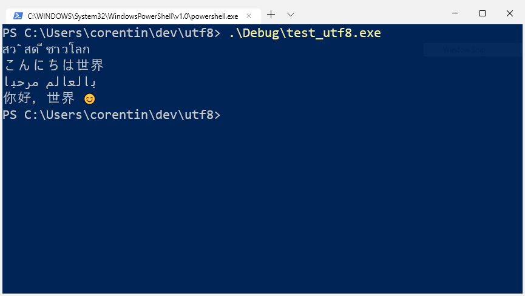

# UTF-8 Programs on windows

This project showcases how to support UTF-8 in windows applications.
By using UTF-8 everywhere, you guarantee your application will be portable accross platforms.




⚠️ UTF-8 support on windows is still fairly bnleeding edge and requires a very recent of windows
That is not widely deployed yet.

## Requirements

* Windows 1903 or greater
* [Windows Terminal](https://github.com/microsoft/terminal)
* Windows SDK 10.0.18362.0 or greater
* [Suitable Fonts](https://www.google.com/get/noto/)

## Steps

* In the main of your application configure the console to expect UTF-8

```
SetConsoleCP(CP_UTF8);
SetConsoleOutputCP(CP_UTF8);
```

* Link the provided manifest to enable UTF-8 as the active code page
* Compile your source files with the `/utf-8` option. Make sure your source files are utf8-encoded.
* Use the ANSI system APIs (functions suffixed with `A`, like `CreateFileA`) with utf-8 encoded string parameters (confusing, isn't it)

